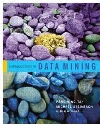

# Biography
---

She is currently an Assistant Professor with the [College of Computer Science and Software Engineering](https://csse.szu.edu.cn/pages/user/index?id=1309), [Shenzhen University](https://www.szu.edu.cn/), China. Before joining Shenzhen University, she was a Senior Researcher with [Tencent Technology Co., Ltd.](https://www.tencent.com/) from 2018 to 2021. She received her Ph.D degree in computer science from [University of Technology Sydney (UTS)](https://www.uts.edu.au/), Australia (2018), supervised by [Prof. Chengqi Zhang](https://profiles.uts.edu.au/Chengqi.Zhang), [A.P. Guodong Long](https://profiles.uts.edu.au/Guodong.Long) and Prof. Peng Zhang, and got her master’s degree from [University of Chinese Academy of Science (UCAS)](https://www.ucas.ac.cn/), Beijing, China, supervised by [Prof. Yingjie Tian](https://people.ucas.ac.cn/~tianyingjie?language=en). During September 2017 to March 2018, She was fortunate to visit [Prof. Wei Wang](https://web.cs.ucla.edu/~weiwang/) with Department of [Computer Science](https://www.cs.ucla.edu/) at [University of California, Los Angeles (UCLA)](https://www.ucla.edu/).

In the past few years, she has been recognized as Overseas High-Caliber Personnel (深圳市海外高层次人才), High-level Talent in Nanshan District of Shenzhen (南山区领航人才).

Her research interests focus on **graph learning**, **natural language processing**, and **open-world machine learning**, etc. She have made contributions to advance graph machine learning methods for solving hard open-world AI problems for real-life applications, including node classification, question answering, anomaly detection, recommender systems and time series clustering. She has published more than 40 research papers in top journals and conferences, including **TPAMI, TKDE, TCYB, NeurIPS, AAAI, IJCAI, CVPR, WWW, ACM MM,** etc., and received several research funds Youth Program of National Natural Science Foundation and General Program of Natural Science Foundation of Guangdong Province. 

# Interests
---

- **Graph Learning**: Graph out-of-distribution detection and generalization, Grpah open-set learning, Graph robust learning;
- **NLP**: LLMs, Question Answering, Reasoning.
  
# News
---

- **Sep, 2024**: A paper, “EGonc : Energy-based Open-Set Node Classification with substitute Unknowns”, is accepted by NeurIPS, 2024. Congratulations, Zelin!
- **Sep, 2024**: A paper, “CHAmbi: A New Benchmark on Chinese Ambiguity Challenges for Large Language Models”, is accepted by EMNLP, 2024. Congratulations, Sihan!
- **July, 2024**: A paper, “Open-world Structured Sequence Learning Via Dense Target Encoding”, is accepted by Information Sciences, 2024. Congratulations, Ziqi!
- **July, 2024**: A paper, “ReCoS: A Novel Benchmark for Cross-Modal Image-Text Retrieval in Complex Real-Life Scenarios”, is accepted by ACM MM, 2024. Congratulations, Jimeng!
- **July, 2024**: A paper, “A Payment Transaction Pre-training Model for Fraud Transaction Detection”, is accepted by CIKM, 2024. Congratulations, Wenxi!
- **Aug, 2024**: I will attend and serve as a session chair in IJCAI 2024 in Jeju Island, South Korea. Hope to see you there.
- **May, 2024**: A paper, “End-to-end approach of multi-grained embedding of categorical features in tabular data”, is accepted by IPM, 2024. Congratulations, Han Liu!
- **May, 2024**: A paper, “A fine-grained self-adapting prompt learning approach for few-shot learning with pre-trained language models”, is accepted by KBS, 2024. Congratulations, Xiaojun!
- **Apr, 2024**: A paper, “CONC: Complex-noise-resistant Open-set Node Classification with Adaptive Noise Detection”, is accepted by IJCAI, 2024. Congratulations, Jiexin!
- **May, 2024**: A paper, “PH-Net: Semi-Supervised Breast Lesion Segmentation via Patch-wise Hardness”, is accepted by CVPR, 2024. Congratulations, Siyao!
- **Dec, 2023**: Two papers, “ROGPL: Robust Open-Set Graph Learning via Region-based Prototype Learning” and “Multi-level Cross-modal Alignment for Image Clustering”, are accepted by AAAI 2024. Congratulations, Xiaowei and Liping!
- **Dec, 2023**: A paper, “Unsupervised multiple choices question answering via universal corpus”, is accepted by ICASSP, 2024. Congratulations, Hao Ge!

# Publications
---

- **EmoGen: Emotional Image Content Generation with Text-to-Image Diffusion Models**
     **Jingyuan Yang**, Jiawei Feng, and Hui Huang\*
     Proceedings of the IEEE Conference on Computer Vision and Pattern Recognition(**CVPR**), 6358-6368, 2024
     \[[Project page](https://vcc.tech/research/2024/EmoGen)\]\[[Code](https://github.com/JingyuanYY/EmoGen)\]\[[PDF](https://openaccess.thecvf.com/content/CVPR2024/html/Yang_EmoGen_Emotional_Image_Content_Generation_with_Text-to-Image_Diffusion_Models_CVPR_2024_paper.html)\]
    
    

    
    

- **EmoSet: A Large-scale Visual Emotion Dataset with Rich Attributes**
     **Jingyuan Yang**, Qirui Huang, Tingting Ding, Dani Lischinski, Daniel Cohen-Or, and Hui Huang\*
     Proceedings of the IEEE International Conference on Computer Vision (**ICCV**), 20383-20394, 2023
     \[[Project page](https://vcc.tech/EmoSet)\]\[[Code](https://github.com/JingyuanYY/EmoSet)\]\[[PDF](https://openaccess.thecvf.com/content/ICCV2023/html/Yang_EmoSet_A_Large-scale_Visual_Emotion_Dataset_with_Rich_Attributes_ICCV_2023_paper.html)\]
    
    

    
    

- **Seeking Subjectivity in Visual Emotion Distribution Learning** 
     **Jingyuan Yang**, Jie Li, Leida Li, Xiumei Wang, Yuxuan Ding, and Xinbo Gao\*
     IEEE Transactions on Image Processing (**TIP**), 31, 5189-5202, 2022
     [[Code](https://github.com/JingyuanYY/SAMNet)\]\[[PDF](https://ieeexplore.ieee.org/abstract/document/9846869)\]
    
    

    
    

- **A Circular-Structured Representation for Visual Emotion Distribution Learning** 
     **Jingyuan Yang**, Jie Li, Leida Li, Xiumei Wang, and Xinbo Gao\*
     Proceedings of the IEEE Conference on Computer Vision and Pattern Recognition (**CVPR**), 4237-4246, 2021
     [[Code](https://github.com/JingyuanYY/Circular-structured-representation)\]\[[PDF](https://openaccess.thecvf.com/content/CVPR2021/html/Yang_A_Circular-Structured_Representation_for_Visual_Emotion_Distribution_Learning_CVPR_2021_paper.html)\]
    
    

    
    

- **SOLVER: Scene-Object Interrelated Visual Emotion Reasoning Network** 
     **Jingyuan Yang**, Xinbo Gao\*, Leida Li, Xiumei Wang, and Jinshan Ding
     IEEE Transactions on Image Processing (**TIP**), 30, 8686-8701, 2021
     [[Code](https://github.com/JingyuanYY/SOLVER)\]\[[PDF](https://ieeexplore.ieee.org/abstract/document/9580604)\]
    
    

    
    

- **Stimuli-Aware Visual Emotion Analysis** 
     **Jingyuan Yang**, Jie Li, Xiumei Wang, Yuxuan Ding, and Xinbo Gao\*
     IEEE Transactions on Image Processing (**TIP**), 30, 7432-7445, 2021
     [[Code](https://github.com/JingyuanYY/Stimuli-aware-VEA)\]\[[PDF](https://ieeexplore.ieee.org/stamp/stamp.jsp?tp=&arnumber=9524517)\]
    
    

    
    

    
# Community Services
---

- Conference Program Session Chair
  - IJCAI session chair (2023, 2024)
- Conference Program Committee/Reviewer
  - Annual Conference on Neural Information Processing Systems (NeurIPS) (2024)
  - AAAI Conference on Artificial Intelligence (AAAI) (2023, 2024)
  - International Joint Conference on Artificial Intelligence (IJCAI) (2023, 2024)
  - ACL(2023,2024)
  - ICDM (2023,2024)
  - EMNLP(2024)
- Journal Reviewer
  - TPAMI (2024)
  - TNNLS (2023, 2024)
  - Pattern Recognition (PR)  (2024)
  - IPM(2023, 2024)
  - KBS(2024)
 
# Teaching
---

    
    

# Selected Awards
---

- **Graphic Open Source Dataset Award**, by CCF CAD&CG, 2024
- **Best Poster Award**, by CSIG CEI, 2023
- **Outstanding Graduate of Shaanxi Province**, by Education Department of Shaanxi Provincial Government, 2022
- **China National Scholarship**, by Ministry of Education of the People's Republic of China, 2015 & 2021
- **Speaking as the only student representative at the 90th Anniversary Celebration of Xidian University**, 2021

